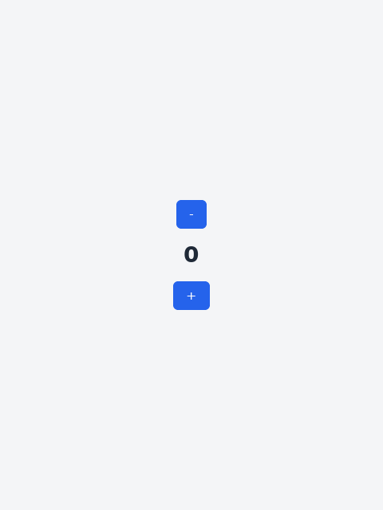
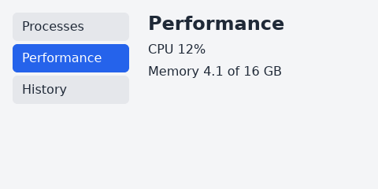
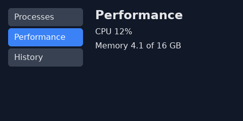
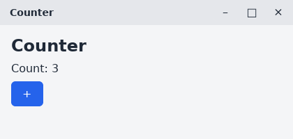
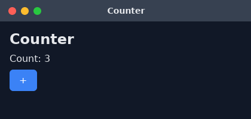

# pane

A window described as a function of your state. A Mote package, written in Mote over `std.sys.gui` with no native code of its own.

| Step | Command or line |
|---|---|
| add it to a package | `$ mote add github:user/pane` (or `pane = { path = "../pane" }` under `[dependencies]`) |
| use it | `import pane` |

You write a `view` that turns a state value into a tree of elements. Handlers on the elements change the state, and the window is drawn again from the new tree; only the nodes that differ are touched. It is built on `std.sys.gui`, which stays available for anything the elements do not cover.

This page covers the state and view, the elements and their modifiers, handlers, components, conditional rendering and paging, themes, keys, state shared with other tasks, the title bar, running on a display, and the modules.

## State and view

The state is a class. The view reads it and answers one element; handlers take the state as a `var` parameter and change it. `pane.run` opens the window and keeps it up to date until it closes.

```mote,skip
import pane

class Counter {
    var count: Int
}

fn view(s: Counter) -> pane.Element<Counter> {
    return pane.vstack([
        pane.button("-").on_click(|var s| { s.count -= 1 }),
        pane.h1("${s.count}"),
        pane.button("+").on_click(|var s| { s.count += 1 }),
    ]).grow().center().gap(16.0)
}

fn main() {
    match pane.run("Counter", Counter { count: 0 }, view) {
        Err(e) => { println("cannot open the window: ${e.message}") }
        _ => { }
    }
}
```



| Modifier on the `vstack` | Effect in the window |
|---|---|
| `grow()` | the stack takes all the space the window leaves, so it fills it |
| `center()` | the children sit in the middle of the stack, across and down, buttons included |
| `gap(16.0)` | 16 px between the children |

Clicking `+` or `-` runs its handler, the view runs again, and the number changes.

## Elements

Every constructor answers an `Element<S>`, where `S` is the state class; the type is inferred from the view's return type.

| Constructor | Shows |
|---|---|
| `text(s)` | a line of 16 px text |
| `h1(s)` to `h6(s)` | bold text at 28, 24, 20, 18, 16 and 14 px |
| `button(label)` | a button in the accent color that darkens under the pointer and darker still when pressed |
| `input(value)` | a one-line text field showing `value` |
| `vstack(kids)` | children one under the other, 8 px apart |
| `hstack(kids)` | children side by side, 8 px apart, centered across |
| `box(kids)` | a plain box that lays its children out in a row |
| `scroll(kids)` | children one under the other that scroll when they do not fit; give it a `height` |

Modifiers answer a changed copy, so they chain: `pane.text("Done").bold().color(0x16a34aff)`.

| Modifier | Sets |
|---|---|
| `pad(px)`, `margin(px)`, `gap(px)` | space inside, outside, and between children |
| `width(px)`, `height(px)`, `grow()` | size; `grow` takes the free space left in the parent |
| `bg(color)`, `color(color)`, `radius(px)` | background, text color, corner radius; colors are `0xRRGGBBAA` |
| `size(px)`, `bold()` | font size and weight |
| `center()` | centers the children, buttons included, or the text of a button |
| `style(f)` | any `std.sys.gui` style method: `el.style(\|s\| s.opacity(0.5))` |
| `key(id)` | names the element among its siblings, see Keys |

## Handlers

A handler is a lambda over the state. Its first parameter is the state and must be written `var`.

| Handler | Runs when | Lambda |
|---|---|---|
| `on_click(f)` | the element, or something inside it, is clicked | `\|var s\| { ... }` |
| `on_change(f)` | an input's text changed | `\|var s, text\| { ... }` |
| `on_submit(f)` | Enter was pressed in an input | `\|var s\| { ... }` |

After each handler the view runs again. An input shows the view's text, so store what the user types or it will not stay:

```mote,skip
pane.input(s.name).on_change(|var s, t| { s.name = t })
```

A click is handled by the nearest element under the pointer, or around it, that has an `on_click`. A handler that does the same work as another is a plain function over `var s`; both handlers call it.

## Components

Components larger than a control are modules you import by name. Each takes the current choice from the state and a handler that stores the next one.

| Import | Function | Shows |
|---|---|---|
| `import { nav } from pane.nav` | `nav(items, selected, on_pick)` | a column of buttons, the selected one highlighted, like a sidebar |
| `import { tabs } from pane.tabs` | `tabs(labels, selected, on_pick)` | a row of buttons, the selected one highlighted |
| `import { pages } from pane.pages` | `pages(count, current, on_pick)` | `<`, up to five page numbers around `current`, and `>` |
| `import { checkbox } from pane.checkbox` | `checkbox(label, checked, on_change)` | a box and a label that flip together |
| `import { select } from pane.select` | `select(options, selected, open, on_change)` | the choice, which opens in place to list the options |
| `import { image } from pane.image` | `image(png)` | a PNG scaled to the element's `width` and `height` |

`on_pick` is `|var s, i| { ... }` and gets the index picked, counting from 0. `checkbox`'s `on_change` gets the new `Bool`. `select`'s gets the choice and whether the list is open, so the state keeps both:

```mote,skip
select(["red", "green", "blue"], s.color, s.open, |var s, i, open| {
    s.color = i
    s.open = open
})
```

## Conditional rendering and paging

The view is a function, so what the window shows is an `if` in it. A sidebar with one item selected and the rest of the window following it:

```mote,skip
import std.sys.gui as gui
import pane
import { nav } from pane.nav

class Monitor {
    var page: Int
}

fn page(s: Monitor) -> pane.Element<Monitor> {
    if s.page == 1 {
        return pane.vstack([pane.h2("Performance"), pane.text("CPU 12%"), pane.text("Memory 4.1 of 16 GB")])
    }
    if s.page == 2 {
        return pane.vstack([pane.h2("History"), pane.text("Nothing recorded yet")])
    }
    return pane.vstack([pane.h2("Processes"), pane.text("mote 1.2%"), pane.text("zed 3.4%")])
}

fn view(s: Monitor) -> pane.Element<Monitor> {
    return pane.hstack([
        nav(["Processes", "Performance", "History"], s.page, |var s, i| { s.page = i })
            .style(|st| st.width(gui.Size.Pct(33.0))),
        page(s),
    ]).grow().style(|st| st.align_items(gui.Align.Start).gap(24.0))
}
```



Only one item is selected because the state holds one number. `width(gui.Size.Pct(33.0))` makes the sidebar a third of the window. A page that was not chosen is not in the tree, so its nodes are removed.

Paging a list is the same: the state holds the page, the view shows that slice of the data, and `pages` changes the page.

```mote,skip
import { pages } from pane.pages

fn view(s: Inbox) -> pane.Element<Inbox> {
    var rows: List<pane.Element<Inbox>> = []
    var i = s.page * 10
    while i < s.subjects.len() && i < s.page * 10 + 10 {
        rows.push(pane.text(s.subjects.get(i)))
        i = i + 1
    }
    return pane.vstack([
        pane.vstack(rows),
        pages((s.subjects.len() + 9) / 10, s.page, |var s, p| { s.page = p }),
    ])
}
```

## Theme

Every element takes its colors from the window's theme, set once when the window opens. A theme is a value from `pane.theme`: the presets are `light()` (the default), `dark()` and `contrast()`.

```mote,skip
import pane
import pane.theme

match pane.run_themed("Monitor", Monitor { page: 0 }, view, theme.dark()) {
    Err(e) => { println(e.message) }
    _ => { }
}
```



A preset changes through methods that answer a changed copy: `theme.dark().accent(0xf97316ff).radius(10.0)`.

| Method | Sets |
|---|---|
| `ink(c)`, `accent_ink(c)` | the text color, and the text color on the accent |
| `page(c)`, `surface(c)`, `quiet(c)` | the window background, the fill of inputs and checkboxes, the fill of choices that are not selected |
| `accent(c)`, `border(c)` | the color of buttons and of the selected choice, the border of inputs and checkboxes |
| `radius(px)` | the corner radius of buttons, inputs and choices |
| `shading(hover, press)` | the percent a pressable color is scaled by under the pointer and when pressed; under 100 darkens |

`bg`, `color` and `style` on an element still win over the theme for that element. For a window you open yourself, `pane.mount_themed(win, state, view, th)` takes the theme.

## Keys

Siblings are matched with the last drawn tree by position and kind. When a list reorders or has items removed from the front, that match moves the wrong node: an input that held focus ends up showing its neighbour. A key says which element is which:

```mote,skip
for n in s.names {
    rows.push(pane.input(n.text).key(n.id).on_change(|var s, t| { s.rename(n.id, t) }))
}
```

An element with a key keeps its node, focus and scroll when it moves among its siblings. An element without a key is matched by position. A key must be unique among its siblings and only names the element in its own list.

## State shared with other tasks

`pane.run` keeps the state in the window's task. When other tasks must change it too, put it in a `Shared` cell and import `pane.shared`. The window shows the cell's current version, and each handler is an update of it. A task that updates the cell calls `win.post(n)` after, which makes the window draw again.

```mote,skip
import std.sys.gui as gui
import std.task as task
import std.time as time
import pane
import { mount_shared } from pane.shared

class Jobs {
    var done: Int
}

fn view(j: Jobs) -> pane.Element<Jobs> {
    return pane.vstack([pane.h2("Jobs done: ${j.done}")])
}

fn main() {
    task.pin()
    let win = gui.open("Jobs", 480, 320).unwrap()
    var jobs = Shared(Jobs { done: 0 })
    var app = mount_shared(win, jobs, view).unwrap()
    scope {
        spawn {
            var cell = jobs
            for i in 0..10 {
                cell.update(|j| { j.done += 1 })
                win.post(1).unwrap()
                time.sleep(time.Duration.from_secs(1))
            }
        }
        app.run().unwrap()
    }
}
```

`mount_shared_themed(win, cell, view, th)` takes a theme. The cell is passed as a `var` because writing it needs one.

## Title bar

By default the system draws the window's frame. `pane.run_chrome` turns the system frame off and draws a title bar in the theme's colors, with minimize, maximize and close buttons and a strip along each edge and corner that resizes the window. The title you pass to `run_chrome` is what the bar shows.

```mote,skip
import pane
import pane.theme
import pane.chrome

match pane.run_chrome("Counter", Counter { count: 0 }, view, theme.dark(), chrome.mac(), 420, 200) {
    Err(e) => { println(e.message) }
    _ => { }
}
```

| Preset | Bar |
|---|---|
| `chrome.system()` | the system's own frame; the default |
| `chrome.flat()` | a slim bar, the title at the left and small rounded buttons at the right |
| `chrome.windows()` | the title at the left and full-height buttons at the right; close turns red under the pointer |
| `chrome.mac()` | round close, minimize and maximize dots at the left and the title in the middle |






Dragging the bar moves the window; the buttons act when clicked. `pane.mount_chrome(win, state, view, th, ch, title)` takes the same for a window you open yourself. Under the hood the bar is elements with an `action(...)`, which a program can give to its own elements: `Move` drags the window, `Resize(edge)` resizes from an edge, and `Minimize`, `Maximize` and `Close` act on a click.

## Running on a display

`pane.run(title, state, view)` pins the calling task, opens the window, and returns when it closes. The size defaults to 480 by 640 pixels and takes two more arguments:

```mote,skip
pane.run("Counter", Counter { count: 0 }, view, 320, 240)
```

Without a display `pane.run` is an `Err`, as in `std.sys.gui`. `demo.mote` beside this file is a larger program: a counter and a to-do form with a scrolling list.

For a window you open yourself, `pane.mount(win, state, view)` draws the view once and answers an app; `app.step(event)` handles one window event and redraws, and `app.run()` steps until the window closes. `pane.run` is `gui.open` followed by those.

## Modules

`import pane` brings in the core. Each part of it is also a file you can import by name, and the larger components are files you import only when you use them.

| Import | Holds |
|---|---|
| `import pane` | the core: `Element`, the controls and layouts, `Theme`, `mount`, `run`; used as `pane.vstack`, `pane.button` and so on |
| `import pane.element` | `Element` and its modifiers |
| `import pane.controls` | `text`, `h1` to `h6`, `button`, `input` |
| `import pane.layout` | `vstack`, `hstack`, `box`, `scroll` |
| `import pane.theme` | `Theme` and the presets `light`, `dark`, `contrast` |
| `import pane.chrome` | `Chrome` and the presets `system`, `flat`, `windows`, `mac` |
| `import pane.app` | `mount`, `mount_themed`, `mount_chrome`, `run`, `run_themed`, `run_chrome` and `App` |
| `import pane.nav`, `tabs`, `pages`, `checkbox`, `select`, `image` | one component each, see Components |
| `import pane.shared` | `mount_shared` and `mount_shared_themed` |

A name imported through both `import pane` and one of these files is the same function, so the two imports can sit together.

## How a redraw works

| Rule | Because |
|---|---|
| the view runs after every handler, and after a `win.post` event | the window always shows the state |
| a keyed child is matched by its key, an unkeyed one by position and kind | a node keeps its place, focus and scroll when its siblings move |
| a child that no longer matches is rebuilt in its place | a changed kind loses only its own focus and scroll |
| an input is rewritten only when the view's text for it changed | typing the state has not yet heard of is not overwritten |
| pointer movement does not run the view | only clicks, input and `step` redraw |

## Behaviour

| Item | Value |
|---|---|
| state | one class value, changed in place by handlers, or a `Shared` cell |
| tree comparison | by key, else by position and kind |
| theme | `light`, `dark` or `contrast`, changed through methods; set once per window |
| title bar | the system's, or one pane draws; a window with the bar drawn by pane shows no resize cursor at its edges and does not maximize on a double click yet |
| not yet | keyboard shortcuts and focus order, tables and sliders |
